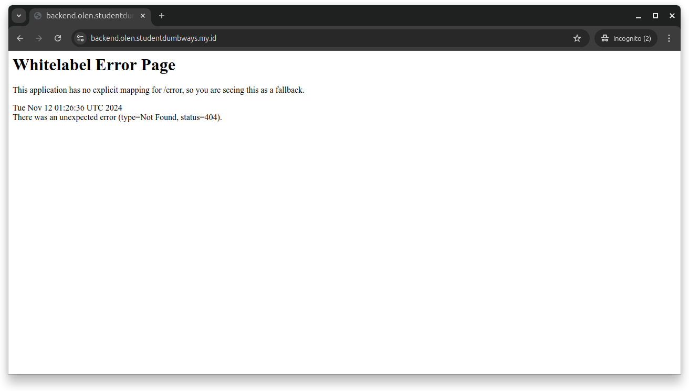
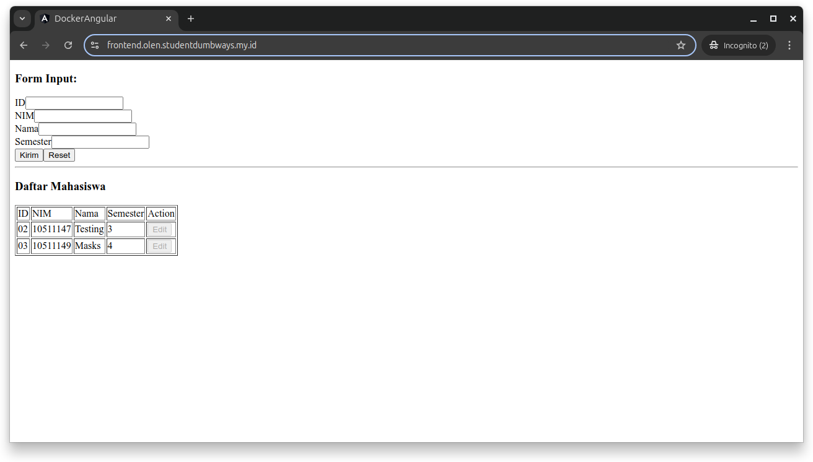
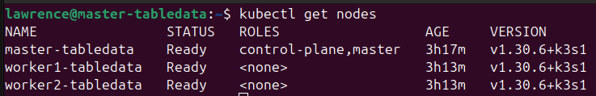
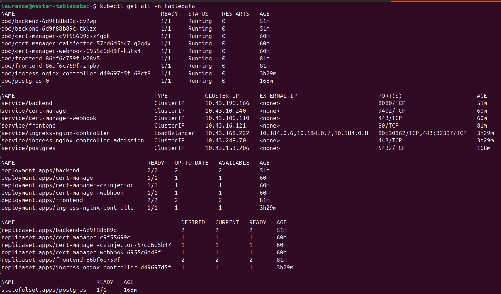
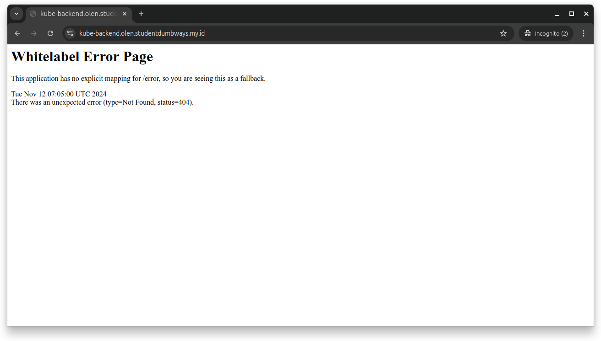
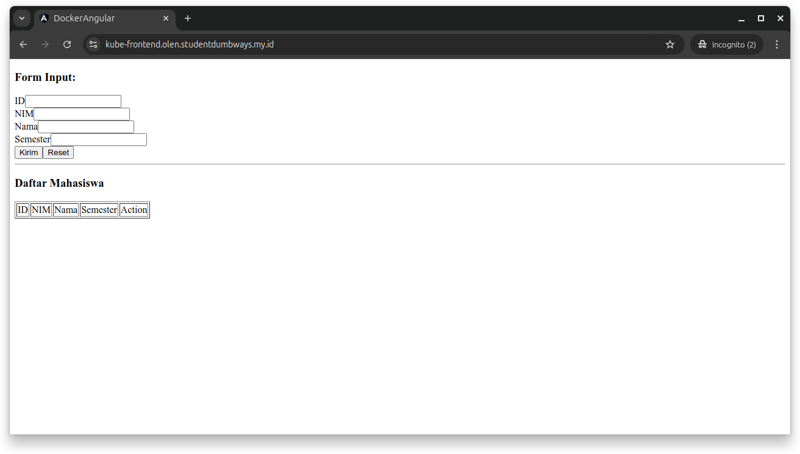

# Pre-Test Bootcamp DevOps

## Task 1 (Virtualization)

Pada Pre-Test ini saya menggunakan tools IaC (Infrastructure as a Code) yaitu Terraform dan Ansible. Lalu saya juga menggunakan Google Cloud Provider (GCP) sebagai Server (VM) yang akan dibuat.

### Terraform

1. Melakukan setup arsitektur pada file providers.tf

  ```
  terraform {
    required_providers {
      google = {
        source = "hashicorp/google"
        version = "6.7.0"
      }
    }
  }

  provider "google" {
    # Configuration options
    project = var.gcp_project_id
    credentials = var.credentials
    region = var.region
    zone = var.zone
  }
  ```
  


2. Membuat file variable.tf yang digunakan untuk mendefinisikan seluruh variabel yang akan dipakai nantinya.

  ```
  variable "region" {
    type = string
    description = "Region for TabelData Project"
    default = "asia-southeast2"
  }

  variable "zone" {
    type = string
    description = "Zone for TabelData Project"
    default = "asia-southeast2-a"
  }

  variable "images_OS" {
    type = map(map(string))
    description = "OS Images for Server"
  }
  ```
  


3. Membuat file terraform.tfvars yang akan digunakan untuk mengatur nilai dari variabel yang sudah dibuat/didefinisikan pada file variable.tf.

  ```
  # OS Images for Server
  images_OS = {
    "linux" = {
      "ubuntu" = "ubuntu-2204-lts"
      "ubuntu20" = "ubuntu-2004-lts"
      "debian" = "debian-12"
      "fedora" = "fedora-coreos-stable"
    }
  }
  ```
  


4. Terakhir, membuat file main.tf yang akan digunakan untuk membuat resource yang ingin dikelola pada infrastruktur.

  ```
  # Create New VM Ubuntu
  resource "google_compute_instance" "vm_instances_tabeldata" {
    for_each = var.vm_instances

    name = each.value.name
    machine_type = each.value.machine_type

    boot_disk {
      initialize_params {
        image = var.images_OS["linux"]["ubuntu20"]
      }
    }

    # Attach VPC and IP Static
    network_interface {
      network = google_compute_network.vpc_network_tabeldata.id
      subnetwork = google_compute_subnetwork.subet_network_tabeldata.id

      access_config {
        // Epheral public IP
        nat_ip = google_compute_address.ip_static_tabeldata[each.value.ip_static].address
      }
    }

    # Attach Firewall
    tags = each.value.tags

    # Metadata for SSH keys
    metadata = {
      ssh-keys = "crocox:${file("${path.module}/ssh_key.pub")}"
    }
  }
  ```
  

  > [!NOTE]
  > Beberapa perintah yang digunakan dalam konfigurasi terraform.
  > 
  > Terraform
  > - terraform init
  > - terraform validate
  > - terraform plan
  > - terraform apply
  > - terraform destroy


### Ansible

  Untuk melihat screeshot dari setup yang sudah dijelaskan dibawah ini dapat anda lihat pada folder docs.

1. Melakukan setup dan installasi docker pada server yang sudah tersedia.

  ```
  # tasks file for Setup
  - hosts: TabelData_Server
  become: yes
  vars_files:
    - ../defaults/main.yml
  tasks:

    # Update System
    - name: "Update and Upgrade Server System"
      apt:
        update_cache: true
        upgrade: dist


    # Installation Docker
    - name: "Install Docker Dependencies"
      apt:
        name: "{{ item }}"
        state: present
      loop:
        - apt-transport-https
        - ca-certificates
        - openssh-client
        - curl
        - software-properties-common
        - htop

    - name: "Add Docker GPG Key"
      apt_key:
        url: https://download.docker.com/linux/ubuntu/gpg
        state: present

    - name: "Add Docker Repository"
      apt_repository:
        repo: "deb [arch=amd64] https://download.docker.com/linux/ubuntu {{ ansible_distribution_release }} stable"
        update_cache: true
        state: present

    - name: "Install Docker Engine and Plugin"
      apt:
        name: "{{ item }}"
        state: present
      loop:
        - docker-ce
        - docker-ce-cli
        - containerd.io
        - docker-buildx-plugin
        - docker-compose-plugin

    - name: "Enabled and Start Docker Service"
      systemd:
        name: "{{ item }}"
        enabled: true
        state: started
      loop:
        - docker.service
        - containerd.service

    - name: "Add user to group docker"
      shell: "sudo usermod -aG docker {{ user_name }}"
  ```

2. Membuat username dan password pada server (VM) yang sudah dibuat.

  ```
  - hosts: TabelData_Server
  become: yes
  vars_files:
    - ../defaults/main.yml
  tasks:
    
    - name: "Create new user"
      user:
        name: "{{ new_user }}"
        password: "{{ password_user }}"
        shell: /bin/bash
        groups: sudo,docker
        state: present
        system: false
        create_home: true
        home: "/home/{{ new_user }}"

    - name: "Enabled SSH"
      service:
        name: ssh
        enabled: true

    - name: "Setup configuration SSH Key and Password"
      lineinfile:
        path: /etc/ssh/sshd_config
        regexp: "{{ item.before }}"
        line: "{{ item.after }}"
      loop:
        - { before: '#PasswordAuthentication no', after: 'PasswordAuthentication yes'}
        - { before: '#PubkeyAuthentication no', after: 'PubkeyAuthentication yes'}

    - name: "Setup configuration file clouding"
      lineinfile:
        path: /etc/ssh/sshd_config.d/60-cloudimg-settings.conf
        regexp: 'PasswordAuthentication no'
        line: PasswordAuthentication yes

    - name: "Set reload SSHD config"
      systemd_service:
        name: sshd
        state: restarted
  ```

3. Melakukan setup ssl cloudflare encryption agar domain dapat diakses secara aman (HTTPS)

  ```
  - hosts: TabelData_Server
  become: yes
  vars_files:
    - ../defaults/main.yml
  tasks:

    - name: "Install SSL Certbot using snap"
      snap:
        name: certbot
        classic: true
        state: present

    - name: "Prepare certbot symlink"
      command: ln -s /snap/bin/certbot /usr/bin/certbot
      args:
        removes: /usr/bin/certbot  # Jika sudah ada tidak akan membuat baru

    - name: "Trust cloudflare DN plugin"
      command: snap set certbot trust-plugin-with-root=ok

    - name: "Install cloudflare DNS plugin"
      snap:
        name: certbot-dns-cloudflare
        state: present

    - name: "Create directory secret"
      file:
        path: "/home/{{ new_user }}/.secret"
        state: directory
        mode: '0700'

    - name: "Create cloudflare credentials file"
      template:
        src: ../templates/cloudflare.ini.j2
        dest: "/home/{{ new_user }}/.secret/cloudflare.ini"

    - name: "Run Certbot to generate certificates"
      command: >
        certbot certonly
        --dns-cloudflare
        --dns-cloudflare-credentials /home/{{ new_user }}/.secret/cloudflare.ini
        --agree-tos
        --non-interactive
        --email lawrencenoman@gmail.com
        --expand
        --domains *.olen.studentdumbways.my.id -v
      timeout: 60
  ```

4. Terakhir, menjalankan nginx dan web profile menggunakan docker compose

  ```
  services:
  nginx:
    container_name: nginx
    image: nginx:latest
    restart: always
    ports:
      - "80:80"
      - "443:443"
    volumes:
      - ./nginx/conf.d/:/etc/nginx/conf.d/
      - /etc/letsencrypt/live/olen.studentdumbways.my.id/fullchain.pem:/etc/nginx/ssl/fullchain.pem
      - /etc/letsencrypt/live/olen.studentdumbways.my.id/privkey.pem:/etc/nginx/ssl/privkey.pem

  profile:
    container_name: profile
    image: crocoxolen/web-profile:latest
    ports:
      - "81:80"
  ```

> [!NOTE]
> Beberapa perintah yang digunakan dalam konfigurasi ansible.
>
> Ansible
> - ansible-galaxy role init your_directory
> - ansible-playbook --syntax-check your_file.yml
> - ansible-playbook your_file.yml


### Hasil Task 1 (virtualization)

Akses Web Profile (https://tabeldata.olen.studentdumbways.my.id/)


## Task 2 (Container)

### Docker Compose

- Sebelumnya docker dan docker compose sudah terinstall pada server menggunakan ansible

- Membuat file docker-compose.yaml untuk melakukan deployment pada container database, backend, dan frontend. Untuk file .env dapat anda buat dan sesuaikan dengan kebutuhan yang diinginkan.

  ```
  services:
  db:
    container_name: postgresql
    image: postgres:14.2
    restart: always
    env_file:
      - .env
    volumes:
      - postgresql_data:/var/lib/postgresql/data
    ports:
      - "5432:5432"

  backend:
    container_name: backend-container
    image: dimmaryanto93/udemy-springboot-app:latest
    restart: always
    ports:
      - "8080:8080"
    depends_on:
      - db
    env_file:
      - .env
    environment:
      - APPLICATION_PORT=${APPLICATION_PORT_BACKEND}

  frontend:
    container_name: frontend-container
    image: dimmaryanto93/udemy-angular-app:latest
    restart: always
    ports:
      - "85:80"
    depends_on:
      - backend
    env_file:
      - .env

  volumes:
    postgresql_data:
  ```

> [!NOTE]
> Beberapa perintah yang digunakan dalam konfigurasi docker compose.
>
> Docker Compose
> - docker compose ps -a
> - docker compose up -d / docker compose -f your_file.yml up -d
> - docker compose down / docker compose -f your_file.yml down
> - docker images
> - docker logs service_name


### Hasil Task 2 (container)

Akses Backend (https://backend.olen.studentdumbways.my.id/)

Akses Frontend (https://frontend.olen.studentdumbways.my.id/)





### kubernetes

Disini saya ingin mencoba melakukan deployment aplikasi (database, backend, frontend) menggunakan Kubernetes Cluster.

1. Langkah pertama melakukan installasi K3S untuk master dan worker, disini saya menggunakan ansible untuk melakukan installasi tersebut.

  - K3S Master

  ```
  # Install K3S Master
  - name: "Install K3S on node master"
    shell: curl -sfL https://get.k3s.io | sh -

  - name: "Fetch K3S token on node master"
    shell: cat /var/lib/rancher/k3s/server/node-token
    register: master_token
    changed_when: false

  - name: "Get master node IP and Token"
    set_fact:
      master_ip: "{{ ansible_host }}"
      k3s_token: "{{ master_token.stdout }}"
  ```

  - K3S agent worker

  ```
  # Install K3S-Agent Worker
  - name: "Install K3S agent on node worker"
    shell: |
      K3S_URL="https://{{ hostvars['master_tabledata'].master_ip }}:6443"
      K3S_TOKEN="{{ hostvars['master_tabledata'].k3s_token }}"
      curl -sfL https://get.k3s.io | K3S_URL=$K3S_URL K3S_TOKEN=$K3S_TOKEN sh -
  ```

  - Cek status apakah sudah terinstall atau belum dengan mengetikkan perintah ``` kubectl get nodes ```
    

1. Selanjutnya, installasi Helm, Cert Manager dan Setup Ingress Nginx

  ```
  # Install Helm
  curl https://raw.githubusercontent.com/helm/helm/main/scripts/get-helm-3 | bash

  # Verfikasi installasi helm
  helm version

  # Tambahkan repository ingress nginx
  helm repo add ingress-nginx https://kubernetes.github.io/ingress-nginx
  helm repo update

  # Install Ingress Nginx menggunakan helm
  helm install ingress-nginx ingress-nginx/ingress-nginx -n your_namespace

  # Tambahkan repository Cert Manager
  helm repo add jetstack https://charts.jetstack.io
  helm repo update

  # Install Cert Manager menggunakan helm
  helm install cert-manager jetstack/cert-manager -n your_namespace --version v1.11.0
  ```

3. Deployment Apps (Database, Backend, Frontend)

  a. Database Deployment

    Membuat file Deployment untuk Database, jangan lupa untuk membuat file secret.yaml terlebih dahulu untuk menyimpan informasi yang sensitif.

    ```
    apiVersion: apps/v1
    kind: StatefulSet
    metadata:
      name: postgres
      namespace: tabledata
    spec:
      serviceName: "postgres"
      replicas: 1
      selector:
        matchLabels:
          app: postgres
      template:
        metadata:
          labels:
            app: postgres
        spec:
          containers:
            - name: postgres
              image: postgres:14.2
              imagePullPolicy: IfNotPresent
              ports:
                - containerPort: 5432
              envFrom:
                - secretRef:
                    name: postgres-secret
              volumeMounts:
                - name: postgres-data
                  mountPath: /var/lib/postgresql/data
          volumes:
          - name: postgres-data
            persistentVolumeClaim:
              claimName: postgres-volume-claim

    ---
    apiVersion: v1
    kind: Service
    metadata:
      name: postgres
      namespace: tabledata
    spec:
      selector:
        app: postgres
      ports:
      - protocol: TCP
        port: 5432
        targetPort: 5432
      type: ClusterIP
    ```

  b. Backend Deployment

    Membuat file Deployment untuk aplikasi Backend, jangan lupa untuk membuat file secret.yaml terlebih dahulu untuk menyimpan informasi yang sensitif.

    ```
    apiVersion: apps/v1
    kind: Deployment
    metadata:
      name: backend
      namespace: tabledata
    spec:
      replicas: 2
      selector:
        matchLabels:
          app: backend
      template:
        metadata:
          labels:
            app: backend
        spec:
          containers:
            - name: backend
              image: dimmaryanto93/udemy-springboot-app:latest
              ports:
                - containerPort: 8080
              envFrom:
                - secretRef:
                    name: backend-secret
              env:
                - name: DATABASE_HOST
                  value: "postgres.tabledata.svc.cluster.local"  # Nama layanan PostgreSQL
                - name: APPLICATION_PORT
                  value: "8080"  # Port aplikasi backend

    ---
    apiVersion: v1
    kind: Service
    metadata:
      name: backend
      namespace: tabledata
    spec:
      selector:
        app: backend
      ports:
        - protocol: TCP
          port: 8080
          targetPort: 8080
          # nodePort: 30020
      # type: NodePort
      type: ClusterIP

    ```

  c. Frontend Deployment

    Membuat file Deployment untuk aplikasi Frontend, jangan lupa untuk membuat file secret.yaml terlebih dahulu untuk menyimpan informasi yang sensitif.

  ```
  apiVersion: apps/v1
  kind: Deployment
  metadata:
    name: frontend
    namespace: tabledata
  spec:
    replicas: 2
    selector:
      matchLabels:
        app: frontend
    template:
      metadata:
        labels:
          app: frontend
      spec:
        containers:
          - name: frontend
            image: dimmaryanto93/udemy-angular-app:latest
            ports:
              - containerPort: 80
            envFrom:
              - secretRef:
                  name: frontend-secret
            env:
              - name: BACKEND_HOST
                value: "backend.tabledata.svc.cluster.local"  # Nama service backend dalam namespace

  ---
  apiVersion: v1
  kind: Service
  metadata:
    name: frontend
    namespace: tabledata
  spec:
    selector:
      app: frontend
    ports:
      - protocol: TCP
        port: 80
        targetPort: 80
        # nodePort: 30025
    # type: NodePort
    type: ClusterIP
  ```

4. Menambahkan Ingress Nginx pada service backend dan frontend agar dapat diakses menggunakan domain yang aman (HTTPS)

  ```
  ---
  apiVersion: networking.k8s.io/v1
  kind: Ingress
  metadata:
    name: ingress-frontend
    namespace: tabledata
    annotations:
      nginx.ingress.kubernetes.io/rewrite-target: /
  spec:
    ingressClassName: nginx
    rules:
      - host: kube-frontend.olen.studentdumbways.my.id
        http:
          paths:
          - pathType: Prefix
            path: "/"
            backend:
              service:
                name: frontend
                port: 
                  number: 80
    tls:
      - hosts:
          - kube-frontend.olen.studentdumbways.my.id
        secretName: wildcard-tls-secret
  ```

5. Periksa selutuh status pada resource apakah sudah berjalan semua atau belum dengan menggunakan perintah ``` kubectl get all -n your_namespace ```

  

### Hasil Kubernetes

Akses Kubernetes Backend (https://kube-backend.olen.studentdumbways.my.id/) 

Akses Kubernetes Frontend (https://kube-frontend.olen.studentdumbways.my.id/)



