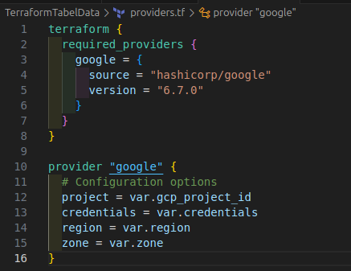
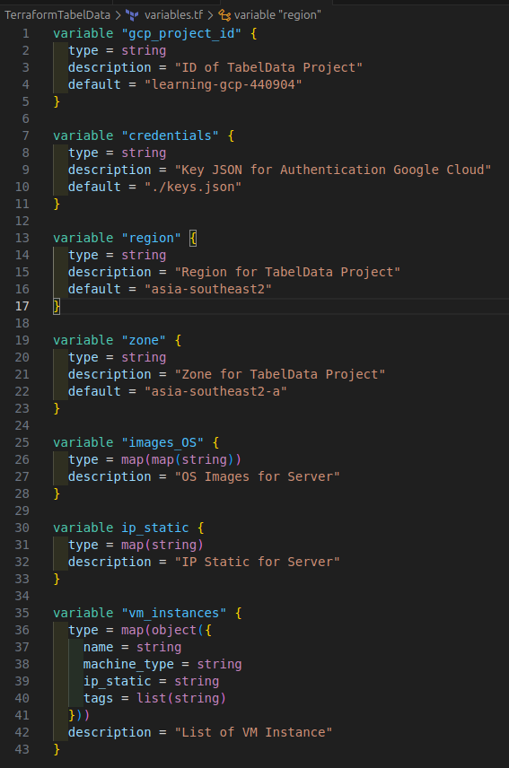
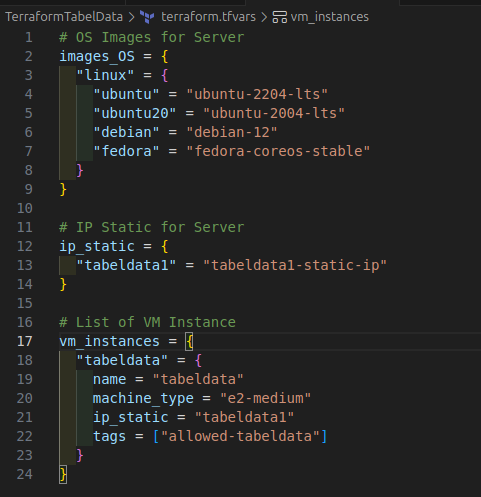
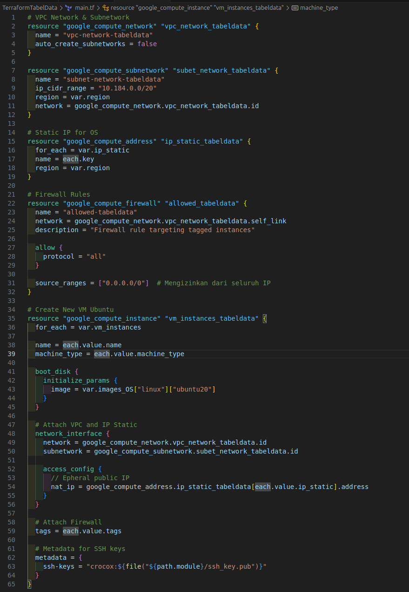
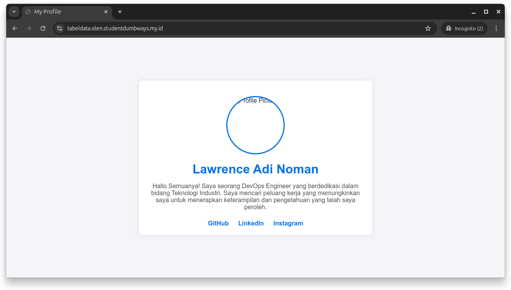

# Pre-Test Bootcamp DevOps

## Task 1 (Virtualization)

Pada Pre-Test ini saya menggunakan tools IaC (Infrastructure as a Code) yaitu Terraform dan Ansible. Lalu saya juga menggunakan Google Cloud Provider (GCP) sebagai Server (VM) yang akan dibuat.

### Terraform

1. Melakukan setup arsitektur pada file providers.tf

  ```
  terraform {
    required_providers {
      google = {
        source = "hashicorp/google"
        version = "6.7.0"
      }
    }
  }

  provider "google" {
    # Configuration options
    project = var.gcp_project_id
    credentials = var.credentials
    region = var.region
    zone = var.zone
  }
  ```
  


2. Membuat file variable.tf yang digunakan untuk mendefinisikan seluruh variabel yang akan dipakai nantinya.

  ```
  variable "region" {
    type = string
    description = "Region for TabelData Project"
    default = "asia-southeast2"
  }

  variable "zone" {
    type = string
    description = "Zone for TabelData Project"
    default = "asia-southeast2-a"
  }

  variable "images_OS" {
    type = map(map(string))
    description = "OS Images for Server"
  }
  ```
  


3. Membuat file terraform.tfvars yang akan digunakan untuk mengatur nilai dari variabel yang sudah dibuat/didefinisikan pada file variable.tf.

  ```
  # OS Images for Server
  images_OS = {
    "linux" = {
      "ubuntu" = "ubuntu-2204-lts"
      "ubuntu20" = "ubuntu-2004-lts"
      "debian" = "debian-12"
      "fedora" = "fedora-coreos-stable"
    }
  }
  ```
  


4. Terakhir, membuat file main.tf yang akan digunakan untuk membuat resource yang ingin dikelola pada infrastruktur.

  ```
  # Create New VM Ubuntu
  resource "google_compute_instance" "vm_instances_tabeldata" {
    for_each = var.vm_instances

    name = each.value.name
    machine_type = each.value.machine_type

    boot_disk {
      initialize_params {
        image = var.images_OS["linux"]["ubuntu20"]
      }
    }

    # Attach VPC and IP Static
    network_interface {
      network = google_compute_network.vpc_network_tabeldata.id
      subnetwork = google_compute_subnetwork.subet_network_tabeldata.id

      access_config {
        // Epheral public IP
        nat_ip = google_compute_address.ip_static_tabeldata[each.value.ip_static].address
      }
    }

    # Attach Firewall
    tags = each.value.tags

    # Metadata for SSH keys
    metadata = {
      ssh-keys = "crocox:${file("${path.module}/ssh_key.pub")}"
    }
  }
  ```
  


### Ansible

  Untuk melihat screeshot dari setup yang sudah dijelaskan dibawah ini dapat anda lihat pada folder docs.

1. Melakukan setup dan installasi docker pada server yang sudah tersedia.

  ```
  # tasks file for Setup
  - hosts: TabelData_Server
  become: yes
  vars_files:
    - ../defaults/main.yml
  tasks:

    # Update System
    - name: "Update and Upgrade Server System"
      apt:
        update_cache: true
        upgrade: dist


    # Installation Docker
    - name: "Install Docker Dependencies"
      apt:
        name: "{{ item }}"
        state: present
      loop:
        - apt-transport-https
        - ca-certificates
        - openssh-client
        - curl
        - software-properties-common
        - htop

    - name: "Add Docker GPG Key"
      apt_key:
        url: https://download.docker.com/linux/ubuntu/gpg
        state: present

    - name: "Add Docker Repository"
      apt_repository:
        repo: "deb [arch=amd64] https://download.docker.com/linux/ubuntu {{ ansible_distribution_release }} stable"
        update_cache: true
        state: present

    - name: "Install Docker Engine and Plugin"
      apt:
        name: "{{ item }}"
        state: present
      loop:
        - docker-ce
        - docker-ce-cli
        - containerd.io
        - docker-buildx-plugin
        - docker-compose-plugin

    - name: "Enabled and Start Docker Service"
      systemd:
        name: "{{ item }}"
        enabled: true
        state: started
      loop:
        - docker.service
        - containerd.service

    - name: "Add user to group docker"
      shell: "sudo usermod -aG docker {{ user_name }}"
  ```

2. Membuat username dan password pada server (VM) yang sudah dibuat.

  ```
  - hosts: TabelData_Server
  become: yes
  vars_files:
    - ../defaults/main.yml
  tasks:
    
    - name: "Create new user"
      user:
        name: "{{ new_user }}"
        password: "{{ password_user }}"
        shell: /bin/bash
        groups: sudo,docker
        state: present
        system: false
        create_home: true
        home: "/home/{{ new_user }}"

    - name: "Enabled SSH"
      service:
        name: ssh
        enabled: true

    - name: "Setup configuration SSH Key and Password"
      lineinfile:
        path: /etc/ssh/sshd_config
        regexp: "{{ item.before }}"
        line: "{{ item.after }}"
      loop:
        - { before: '#PasswordAuthentication no', after: 'PasswordAuthentication yes'}
        - { before: '#PubkeyAuthentication no', after: 'PubkeyAuthentication yes'}

    - name: "Setup configuration file clouding"
      lineinfile:
        path: /etc/ssh/sshd_config.d/60-cloudimg-settings.conf
        regexp: 'PasswordAuthentication no'
        line: PasswordAuthentication yes

    - name: "Set reload SSHD config"
      systemd_service:
        name: sshd
        state: restarted
  ```

3. Melakukan setup ssl cloudflare encryption agar domain dapat diakses secara aman (HTTPS)

  ```
  - hosts: TabelData_Server
  become: yes
  vars_files:
    - ../defaults/main.yml
  tasks:

    - name: "Install SSL Certbot using snap"
      snap:
        name: certbot
        classic: true
        state: present

    - name: "Prepare certbot symlink"
      command: ln -s /snap/bin/certbot /usr/bin/certbot
      args:
        removes: /usr/bin/certbot  # Jika sudah ada tidak akan membuat baru

    - name: "Trust cloudflare DN plugin"
      command: snap set certbot trust-plugin-with-root=ok

    - name: "Install cloudflare DNS plugin"
      snap:
        name: certbot-dns-cloudflare
        state: present

    - name: "Create directory secret"
      file:
        path: "/home/{{ new_user }}/.secret"
        state: directory
        mode: '0700'

    - name: "Create cloudflare credentials file"
      template:
        src: ../templates/cloudflare.ini.j2
        dest: "/home/{{ new_user }}/.secret/cloudflare.ini"

    - name: "Run Certbot to generate certificates"
      command: >
        certbot certonly
        --dns-cloudflare
        --dns-cloudflare-credentials /home/{{ new_user }}/.secret/cloudflare.ini
        --agree-tos
        --non-interactive
        --email lawrencenoman@gmail.com
        --expand
        --domains *.olen.studentdumbways.my.id -v
      timeout: 60
  ```

4. Terakhir, menjalankan nginx dan web profile menggunakan docker compose

  ```
  services:
  nginx:
    container_name: nginx
    image: nginx:latest
    restart: always
    ports:
      - "80:80"
      - "443:443"
    volumes:
      - ./nginx/conf.d/:/etc/nginx/conf.d/
      - /etc/letsencrypt/live/olen.studentdumbways.my.id/fullchain.pem:/etc/nginx/ssl/fullchain.pem
      - /etc/letsencrypt/live/olen.studentdumbways.my.id/privkey.pem:/etc/nginx/ssl/privkey.pem

  profile:
    container_name: profile
    image: crocoxolen/web-profile:latest
    ports:
      - "81:80"
  ```

### Hasil Task 1 (virtualization)
  


## Task 2 (Container)